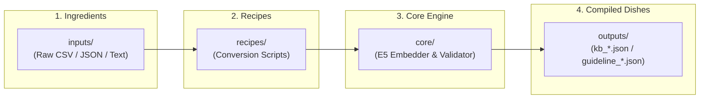

# VectOrGenerate (`vect-or-generate`)

<p align="center">
  
  
  = 18.0.0" />
  
  
  
</p>

**VectOrGenerate** is a standalone, AI-powered knowledge synthesis pipeline, CLI compiler, and interactive Web GUI workbench for [VectOrEdit](https://github.com/vect-organization).  
It transforms arbitrary domain text (medical, legal, creative, real estate) into compliant **10-Layer Semantic Knowledge Bases**, generating 384-dimensional vector embeddings locally via ONNX Runtime without external API keys or cloud dependencies.

---

## 🌟 Interactive GUI: Generator Studio

VectOrGenerate now includes a dedicated modern Web GUI workbench (`studio/`) built with React 19, Tailwind CSS, and Transformers.js:

```bash
# Launch Generator Studio Web GUI
npm run studio
# Or via CLI
node bin/cli.mjs --studio
```

* **10-Layer Visual Navigator**: Inspect and toggle layer masks (L0〜L9).
* **In-Browser ONNX Inference**: High-precision vector generation powered by `multilingual-e5-small.onnx` with WebGPU / WASM acceleration.
* **Advanced Cleansing & Privacy Suite**: Provenance stripping, back-translation syntactic obfuscation, ID permutation shuffle, and differential privacy noise ($\text{DP-}\epsilon$) with real-time 2-axis radar scoring.
* **1-Click 3-Artifacts Sync**: Export `kb_{domain}.json`, `guideline_{domain}.json`, and `ime_{domain}.txt` directly.

---

## 🍳 Concept Architecture (The Kitchen Model)

VectOrGenerate adopts a clean, modular input-to-output pipeline structured around a clear **"Kitchen & Recipe"** workflow:



| Component | Directory | Role & Description |
| :--- | :--- | :--- |
| **Studio GUI** | `studio/` | Web GUI workbench for interactive visualization, CSV drop, and in-browser AI embeddings. |
| **Standards** | `schemas/` | W3C/DIKWP 10-layer semantic specifications and JSON Schema Draft-07 contracts. |
| **Templates** | `templates/` | Starter templates for 10-layer raw items, profiles, and custom conversion recipes. |
| **Ingredients** | `inputs/` | Dropzone for source documents, CSVs, or unvectorized JSON files. |
| **Recipes** | `recipes/` | Parsers and workflow scripts defining how raw data is transformed. |
| **Kitchen** | `core/` | Reusable Transformer embedding engine (`multilingual-e5-small`) and validators. |
| **Dishes** | `outputs/` | Ready-to-use 384-dim vector knowledge bases (`kb_*.json`) for VectOrEdit. |

---

## 🚀 Quick Start (CLI)

### 1. Installation

```bash
# Clone the repository
git clone https://github.com/1abcdefggs/vect-or-generate.git
cd vect-or-generate

# Install dependencies (Transformers ONNX runtime)
npm install
```

### 2. Generate a Knowledge Base

#### A. Using the Standard CLI
Place your raw JSON file into `inputs/my_domain_data.json`, then run:

```bash
# Generate 384-dim vector embeddings
node bin/cli.mjs --input inputs/my_domain_data.json --output outputs/kb_my_domain.json

# Or using the domain shorthand:
node bin/cli.mjs --domain my_domain
```

#### B. Dry-Run Mode (Validation Only)
Quickly validate JSON structure and schema compliance without computing embeddings:

```bash
node bin/cli.mjs --input inputs/my_domain_data.json --output outputs/kb_my_domain.json --dry-run
```

---

## 📐 Base Specification (`schemas/`)

Every output produced by VectOrGenerate strictly conforms to the **10-Layer Semantic Hierarchy**:

```
【 Purpose / Pragmatic 】
  10. Intent & Purpose (Context & Goal)
   9. Dynamic Inference & Lint Rules  -> outputs/guideline_{domain}.json

【 Semantic / Knowledge 】
   8. Knowledge Graph / Ontology
   7. Document Schema / Slot Presets  -> outputs/preset_{domain}.json
   6. Domain Corpus & Sample Phrases
   5. Fact Base & 384-dim Vectors     -> outputs/kb_{domain}.json

【 Lexical & Syntactic 】
   4. Taxonomy (Hierarchy)
   3. Thesaurus (Synonyms)
   2. Terminology & Definitions
   1. Controlled Vocabulary / IME     -> outputs/ime_{domain}.txt
```

---

## 🛠️ Programmatic API Usage

You can embed VectOrGenerate into Web UIs, Electron apps, or Node.js backends:

```javascript
import { embedPassage, embedPassages, embedQuery } from 'vect-or-generate';

// 1. Embed a single document passage (adds "passage: " prefix for E5)
const docVector = await embedPassage("Clause snippet regarding confidentiality obligations.");

// 2. Parallel batch embedding (3-5x faster)
const batchVectors = await embedPassages(["Clause 1", "Clause 2", "Clause 3"]);

// 3. Embed a search query (adds "query: " prefix for E5)
const queryVector = await embedQuery("NDA non-disclosure agreement obligations");
```

---

## 📄 License & Copyright

Copyright (c) 2026 1abcdefggs  
Released under the [MIT License](LICENSE).  
Repository: [https://github.com/1abcdefggs/vect-or-generate](https://github.com/1abcdefggs/vect-or-generate)
